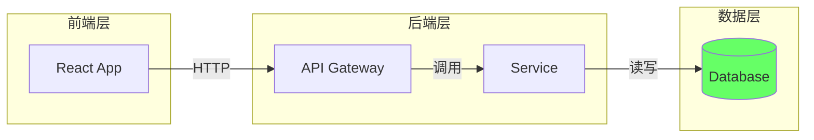
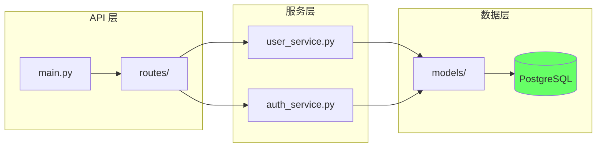
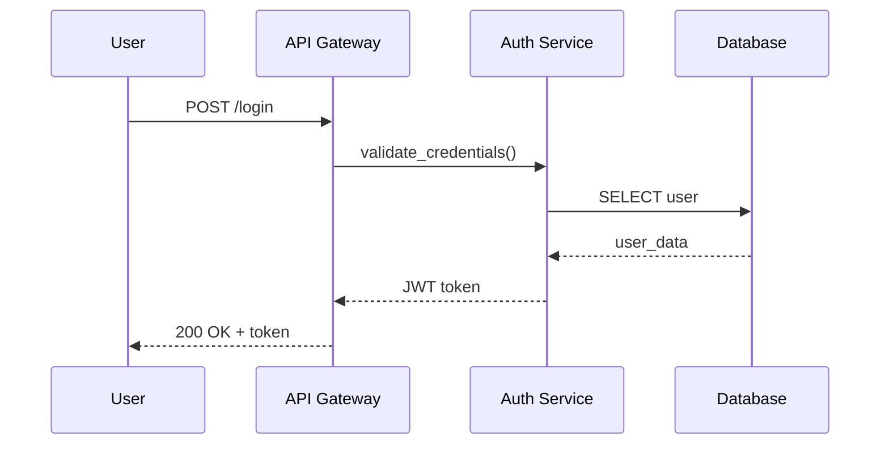

# architecture-spec Skill

AI 与人类之间架构可视化交互的标准规范。支持 Mermaid 和 Obsidian Canvas JSON 两种格式。

## When to Use This Skill

触发条件（满足任一即可）：
- 需要生成项目架构图
- 需要分析/可视化系统结构
- 进行 Canvas 白板驱动开发
- Code Review 时需要架构视图
- 需要生成时序图、数据流图
- 用户提到"架构图"、"Mermaid"、"Canvas"、"可视化"等关键词

## Not For / Boundaries

此技能不适用于：
- 纯代码生成（无需可视化）
- 简单的文件列表或目录树
- UI/UX 设计图（使用设计工具）

必要输入（缺失时需询问）：
1. 输出格式：A) Mermaid B) Canvas JSON C) 两者都要？
2. 粒度级别：A) 文件级 B) 类/函数级 C) 服务级 D) 系统级？
3. 关注点：依赖关系 / 数据流 / 调用链 / 风险点？

## Quick Reference

### 格式选择指南

| 场景 | 推荐格式 | 理由 |
|:---|:---|:---|
| 快速迭代、文档嵌入 | Mermaid | 文本格式，版本控制友好 |
| 复杂项目、团队协作 | Canvas JSON | 视觉效果好，可拖拽编辑 |
| PR/MR 描述 | Mermaid | GitHub/GitLab 原生渲染 |
| 长期维护的架构文档 | 两者都要 | Mermaid 快速查看，Canvas 深入分析 |

### 统一颜色编码（6 色系统）

| # | 颜色 | Mermaid style | Canvas color | 用途 |
|:---|:---|:---|:---|:---|
| 1 | 🔴 红色 | `fill:#f66` | `"1"` | 缓存、热点、警告 |
| 2 | 🟠 橙色 | `fill:#f96` | `"2"` | 消息队列、异步 |
| 3 | 🟡 黄色 | `fill:#ff6` | `"3"` | 入口、外部输入 |
| 4 | 🟢 绿色 | `fill:#6f6` | `"4"` | 数据库、持久化 |
| 5 | 🔵 蓝色 | `fill:#6bf` | `"5"` | 外部服务、API |
| 6 | 🟣 紫色 | `fill:#c6f` | `"6"` | 注释、设计决策 |

### Mermaid 输出规范

**节点命名**：
```
PascalCase["显示名称\n文件路径"]
```

**连线类型**：
```
A --> B      同步调用
A ..> B      异步调用
A -.-> B     可选依赖
A ==> B      数据流
```

**标准布局**：


### Canvas JSON 输出规范

**节点内容模板**：
```markdown
**{组件名}**
`{文件路径}`

**职责**: {一句话描述}
**复杂度**: Low/Medium/High
```

**布局规则**：
- 水平方向：前端 → API → 服务 → 数据
- 垂直方向：按业务领域分组
- 节点尺寸：宽 200-280，高 80-150
- 间距：100-150

### AI 输出模板

```markdown
## 📊 架构图

\`\`\`mermaid
{图表代码}
\`\`\`

## 🔍 洞察摘要

- **架构模式**: {识别的模式}
- **核心组件**: {N} 个
- **关键路径**: {最重要的调用链}
- **潜在风险**: {循环依赖/热点/技术债}

## ⚠️ 需要确认

1. {待确认问题}

## 📝 下一步建议

- {建议}
```

## Rules & Constraints

### MUST（必须遵守）

- 节点必须使用 PascalCase 命名
- 连线必须标注关系类型（调用/依赖/数据流）
- 颜色必须使用统一的 6 色编码
- 输出必须包含洞察摘要，不只是图

### SHOULD（强烈建议）

- 布局方向统一为 LR（左到右）或 TB（上到下）
- 复杂系统使用 subgraph 分组
- 标注潜在风险点（循环依赖、热点）
- 提供下一步建议

### NEVER（禁止）

- 不要生成"信息垃圾"（简单罗列所有文件）
- 不要省略关键的依赖关系
- 不要使用非标准颜色编码
- 不要只输出图不输出解释

## Examples

### Example 1: 快速架构分析

**输入**: "分析这个 FastAPI 项目的架构"

**步骤**:
1. 扫描项目目录结构
2. 识别入口、路由、服务、模型
3. 分析 import 依赖关系
4. 生成 Mermaid flowchart
5. 输出洞察摘要

**预期输出**:


### Example 2: Canvas 白板生成

**输入**: "生成这个微服务项目的 Canvas 白板"

**步骤**:
1. 识别所有服务及其职责
2. 分析服务间通信方式
3. 生成 Canvas JSON
4. 应用颜色编码和布局规则

**预期输出**: 符合规范的 `.canvas` JSON 文件

### Example 3: 时序图生成

**输入**: "画出用户登录的调用时序"

**步骤**:
1. 识别参与的组件
2. 追踪调用链
3. 生成 Mermaid sequenceDiagram

**预期输出**:


## FAQ

**Q: Mermaid 和 Canvas 选哪个？**
- A: 快速迭代用 Mermaid（文本格式，易于版本控制）；复杂项目用 Canvas（可视化效果好，支持拖拽）。

**Q: 粒度怎么选？**
- A: 新手/小项目选文件级；大项目/微服务选服务级；性能分析选函数级。

**Q: 颜色编码记不住怎么办？**
- A: 记住核心三个：🟢绿色=数据库，🔴红色=警告/缓存，🔵蓝色=外部服务。

## References

- `references/index.md` - 参考文档导航
- `references/mermaid-spec.md` - Mermaid 详细规范
- `references/canvas-spec.md` - Canvas JSON 详细规范
- `references/interaction-protocol.md` - 交互协议详解
- `templates/` - 可直接使用的模板

## Maintenance

- Sources: vibe-coding-cn/skills/canvas-dev/, vibe-coding-cn/prompts/系统架构可视化生成Mermaid.md
- Last updated: 2026-01-15
- Known limits: Mermaid 复杂度有上限；Canvas 需要 Obsidian 渲染
