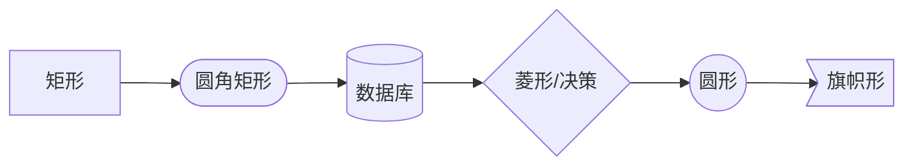
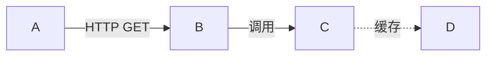
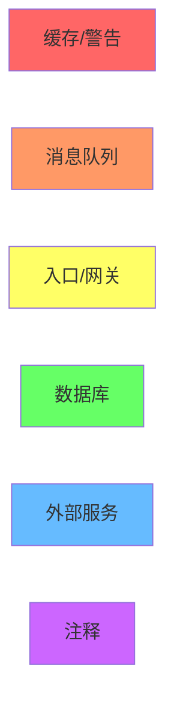
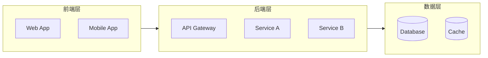
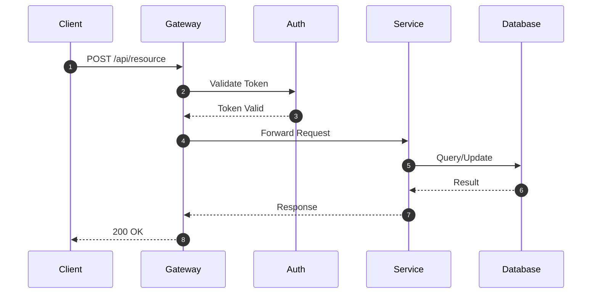

# Mermaid 输出规范

## 支持的图表类型

| 类型 | 语法 | 用途 |
|:---|:---|:---|
| 流程图 | `flowchart LR/TB` | 架构图、数据流、模块关系 |
| 时序图 | `sequenceDiagram` | API 调用链、交互流程 |
| 类图 | `classDiagram` | 类关系、接口定义 |
| ER 图 | `erDiagram` | 数据模型、表关系 |
| 状态图 | `stateDiagram-v2` | 状态机、工作流 |

## 节点命名规范

### 格式

```
NodeId["显示名称\n附加信息"]
```

### 规则

| 规则 | 示例 | 说明 |
|:---|:---|:---|
| 使用 PascalCase | `UserService` | 节点 ID |
| 包含文件路径 | `UserService["UserService\nsrc/services/user.py"]` | 便于定位 |
| 简洁明了 | `API["API Gateway"]` | 显示名称 |

### 特殊节点形状



## 连线类型规范

### 箭头类型

| 语法 | 含义 | 场景 |
|:---|:---|:---|
| `-->` | 同步调用 | 函数调用、HTTP 请求 |
| `..>` | 异步调用 | 消息队列、事件 |
| `-.->` | 可选依赖 | 可选配置、降级路径 |
| `==>` | 数据流 | 数据传输、ETL |
| `---` | 关联（无方向） | 关系标注 |

### 连线标签



**必须标注的场景**：
- 跨服务调用
- 不同协议
- 关键业务逻辑

## 颜色编码规范

### 标准 6 色



### 应用规则

| 颜色 | 代码 | 应用于 |
|:---|:---|:---|
| 🔴 红色 | `fill:#f66` | Redis, 缓存, 热点模块, 警告 |
| 🟠 橙色 | `fill:#f96` | Kafka, RabbitMQ, 消息队列 |
| 🟡 黄色 | `fill:#ff6` | API Gateway, 入口, 外部输入 |
| 🟢 绿色 | `fill:#6f6` | PostgreSQL, MySQL, 数据库 |
| 🔵 蓝色 | `fill:#6bf` | 第三方 API, 外部服务 |
| 🟣 紫色 | `fill:#c6f` | 注释节点, 设计决策 |

## 布局规范

### 方向选择

| 方向 | 语法 | 适用场景 |
|:---|:---|:---|
| 左到右 | `flowchart LR` | 数据流、调用链（推荐） |
| 上到下 | `flowchart TB` | 层级架构、继承关系 |
| 右到左 | `flowchart RL` | 响应流程 |
| 下到上 | `flowchart BT` | 依赖关系 |

### 分组（subgraph）



### 分组命名规则

- 使用中文/英文标签：`subgraph Name["显示名称"]`
- 层级命名：前端层、后端层、数据层、基础设施层
- 业务命名：用户模块、订单模块、支付模块

## 完整示例

### 微服务架构图

```mermaid
flowchart LR
    subgraph Client["客户端"]
        WEB[Web App]
        APP[Mobile App]
    end
    
    subgraph Gateway["网关层"]
        GW[API Gateway]
        AUTH[Auth Service]
    end
    
    subgraph Services["服务层"]
        USER[User Service]
        ORDER[Order Service]
        PAY[Payment Service]
    end
    
    subgraph Data["数据层"]
        DB_USER[(User DB)]
        DB_ORDER[(Order DB)]
        REDIS[(Redis)]
        MQ[Message Queue]
    end
    
    WEB -->|HTTPS| GW
    APP -->|HTTPS| GW
    GW -->|验证| AUTH
    GW -->|路由| USER
    GW -->|路由| ORDER
    GW -->|路由| PAY
    
    USER -->|读写| DB_USER
    ORDER -->|读写| DB_ORDER
    ORDER ..>|事件| MQ
    PAY ..>|订阅| MQ
    USER -.->|缓存| REDIS
    
    style REDIS fill:#f66
    style MQ fill:#f96
    style GW fill:#ff6
    style DB_USER fill:#6f6
    style DB_ORDER fill:#6f6
```

### API 调用时序图



## 常见问题

**Q: 图太复杂怎么办？**
- A: 使用 subgraph 分组；提高抽象粒度（文件级→服务级）；拆分为多个图。

**Q: GitHub/GitLab 渲染有问题？**
- A: 避免使用高级语法；测试平台兼容性；必要时转为 PNG 图片。

**Q: 如何保持一致性？**
- A: 使用本规范的颜色编码；统一节点命名风格；团队共享模板。
