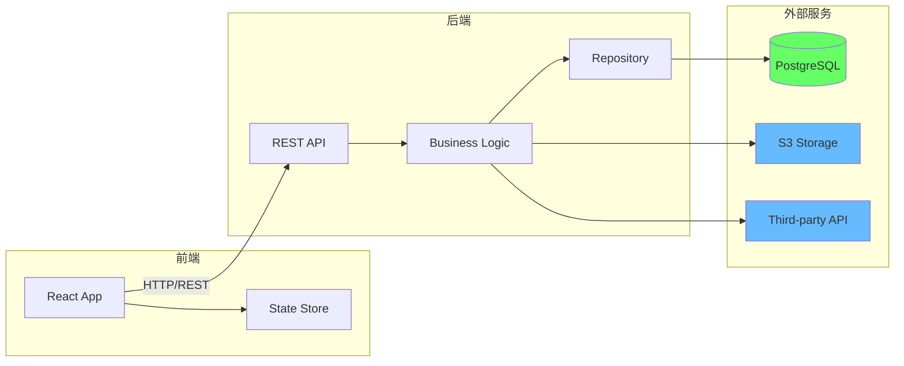
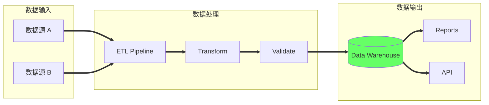
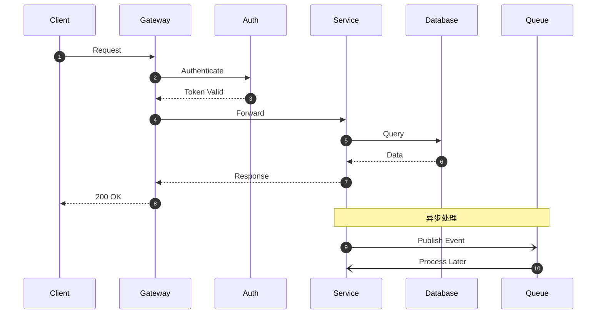

# Mermaid 架构图模板

## 三层架构模板

```mermaid
flowchart LR
    subgraph Presentation["表现层"]
        direction TB
        WEB[Web App]
        API_DOC[API 文档]
    end
    
    subgraph Business["业务层"]
        direction TB
        SVC1[Service A]
        SVC2[Service B]
        SVC3[Service C]
    end
    
    subgraph Data["数据层"]
        direction TB
        DB[(Database)]
        CACHE[(Cache)]
        MQ[Message Queue]
    end
    
    WEB --> SVC1
    WEB --> SVC2
    SVC1 --> DB
    SVC2 --> DB
    SVC2 ..> MQ
    SVC3 ..> MQ
    SVC1 -.-> CACHE
    
    style DB fill:#6f6
    style CACHE fill:#f66
    style MQ fill:#f96
```

## 微服务架构模板

```mermaid
flowchart TB
    subgraph Client["客户端"]
        WEB[Web]
        APP[Mobile]
    end
    
    subgraph Gateway["网关层"]
        GW[API Gateway]
        AUTH[Auth Service]
    end
    
    subgraph Services["微服务"]
        USER[User Service]
        ORDER[Order Service]
        PAY[Payment Service]
        NOTIFY[Notification]
    end
    
    subgraph Infra["基础设施"]
        DB_USER[(User DB)]
        DB_ORDER[(Order DB)]
        REDIS[(Redis)]
        KAFKA[Kafka]
    end
    
    Client --> GW
    GW --> AUTH
    GW --> USER
    GW --> ORDER
    GW --> PAY
    
    USER --> DB_USER
    ORDER --> DB_ORDER
    ORDER ..> KAFKA
    PAY ..> KAFKA
    NOTIFY ..> KAFKA
    USER -.-> REDIS
    
    style GW fill:#ff6
    style DB_USER fill:#6f6
    style DB_ORDER fill:#6f6
    style REDIS fill:#f66
    style KAFKA fill:#f96
```

## 前后端分离模板



## 数据流模板



## 时序图模板



## 使用说明

1. **复制模板**: 选择合适的模板复制
2. **修改节点**: 替换节点名称和标签
3. **调整连线**: 根据实际依赖关系修改箭头
4. **应用颜色**: 使用 style 语句应用颜色编码
5. **验证渲染**: 在支持 Mermaid 的工具中预览

## 颜色编码速查

```
style NODE fill:#f66  # 红色: 缓存/热点/警告
style NODE fill:#f96  # 橙色: 消息队列/异步
style NODE fill:#ff6  # 黄色: 入口/网关
style NODE fill:#6f6  # 绿色: 数据库
style NODE fill:#6bf  # 蓝色: 外部服务
style NODE fill:#c6f  # 紫色: 注释
```
